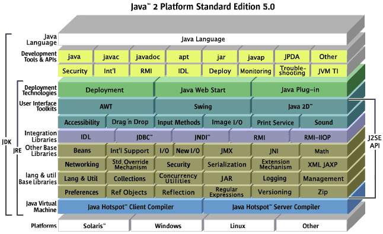

# 基础知识
## 基本常识

1.  JAVA语言特性
    > Java是一种具有“**简单、面向对象、分布式、解释型、健壮、安全、与体系结构无关、可移植、高性能、多线程和动态执行**”等特点的语言。

    1) **简单**:Java语言的语法与C语言和C++语言很接近，使得大多数程序员很容易学习和使用Java。另一方面，Java丢弃了C++ 中很少使用的、很难理解的、令人迷惑的那些特性，如操作符重载、多继承、自动的强制类型转换。特别地，Java语言不使用指针，并提供了自动的废料收集，使得程序员不必为内存管理而担忧。

    2) **面向对象**:Java语言提供类、接口和继承等原语，为了简单起见，只支持类之间的单继承，但支持接口之间的多继承，并支持类与接口之间的实现机制(关键字为implements)。Java语言全面支持动态绑定，而C++ 语言只对虚函数使用动态绑定。总之，Java语言是一个纯的面向对象程序设计语言。

    3) **分布式**:Java语言支持Internet应用的开发，在基本的Java应用编程接口中有一个网络应用编程接口(java.net)，它提供了用于网络应用编程的类库，包括URL、URLConnection、Socket、 ServerSocket等。Java的RMI(远程方法激活)机制也是开发分布式应用的重要手段。

    4) **健壮**:Java的强类型机制、异常处理、废料的自动收集等是Java程序健壮性的重要保证。对指针的丢弃是Java的明智选择。Java的安全检查机制使得Java更具健壮性。

    5) **安全**:Java通常被用在网络环境中，为此，Java提供了一个安全机制以防恶意代码的攻击。除了Java语言具有的许多安全特性以外，Java对通过网络下载的类具有一个安全防范机制(类ClassLoader)，如分配不同的名字空间以防替代本地的同名类、字节代码检查，并提供安全管理机制(类SecurityManager)让Java应用设置安全哨兵。

    6) **与体系结构无关**:Java程序(后缀为java的文件)在Java平台上被编译为体系结构中立的字节码格式(后缀为class的文件), 然后可以在实现这个Java平台的任何系统中运行。这种途径适合于异构的网络环境和软件的分发。

    7) **可移植**:这种可移植性来源于体系结构中立性，另外，Java还严格规定了各个基本数据类型的长度。Java系统本身也具有很强的可移植性，Java编译器是用Java实现的，Java的运行环境是用ANSI C实现的。

    8) **解释型**:Java程序在Java平台上被编译为字节码格式， 然后可以在实现这个Java平台的任何系统中运行。在运行时，Java平台中的Java解释器对这些字节码进行解释执行，执行过程中需要的类在联接阶段被载入到运行环境中。

    9) **高性能**:与那些解释型的高级脚本语言相比，Java的确是高性能的。事实上，Java的运行速度随着JIT(Just-In-Time)编译器技术的发展越来越接近于C++。

    10) **多线程**:在Java语言中，线程是一种特殊的对象，它必须由Thread类或其子(孙)类来创建。通常有两种方法来创建线程:其一，使用型构为Thread(Runnable) 的构造子将一个实现了Runnable接口的对象包装成一个线程，其二，从Thread类派生出子类并重写run方法，使用该子类创建的对象即为线程。值得注意的是Thread类已经实现了Runnable接口，因此，任何一个线程均有它的run方法，而run方法中包含了线程所要运行的代码。线程的活动由一组方法来控制。 Java语言支持多个线程的同时执行，并提供多线程之间的同步机制(关键字为synchronized)。

    11) **动态执行**:Java语言的设计目标之一是适应于动态变化的环境。Java程序需要的类能动态地被载入到运行环境，也可以通过网络来载入所需要的类。这也有利于软件的升级。另外，Java中的类有一个运行时刻的表示，能进行运行时刻的类型检查。
   
2.  JDK/JRE/JVM
    1) **JDK**:Java Development ToolKit(Java开发工具包)。JDK是整个JAVA的核心，包括了Java运行环境(Java Runtime Envirnment)，一堆Java工具(javac/java/jdb等)和Java基础的类库(即Java API包括rt.jar)。
   
    2) **JRE**:Java Runtime Enviromental(java运行时环境)。也就是JAVA平台，所有的Java程序都要在JRE下才能运行。包括JVM和JAVA核心类库和支持文件。与JDK相比，它不包含开发工具——编译器、调试器和其它工具。
   
    3) **JVM**:Java Virtual Mechinal(JAVA虚拟机)。JVM是JRE的一部分，它是一个虚构出来的计算机，是通过在实际的计算机上仿真模拟各种计算机功能来实现的。JVM有自己完善的硬件架构，如处理器、堆栈、寄存器等，还具有相应的指令系统。JVM的主要工作是解释自己的指令集(即字节码)并映射到本地的CPU的指令集或OS的系统调用。Java语言是跨平台运行的，其实就是不同的操作系统，使用不同的JVM映射规则，让其与操作系统无关，完成了跨平台性。JVM对上层的Java源文件是不关心的，它关注的只是由源文件生成的类文件(class file)。类文件的组成包括JVM指令集，符号表以及一些补助信息。
   
        

## 数据类型

1.  基本数据类型
    - **整数类型**
        - **byte**:8位，最大存储数据量是255，存放的数据范围是-128~127之间。
        - **short**:16位，最大数据存储量是65536，数据范围是-32768~32767之间。
        - **int**:32位，最大数据存储容量是2的32次方减1，数据范围是负的2的31次方到正的2的31次方减1。
        - **long**:64位，最大数据存储容量是2的64次方减1，数据范围为负的2的63次方到正的2的63次方减1。
    - **浮点类型**
        - **float**:32位，数据范围在3.4e-45~1.4e38，直接赋值时必须在数字后加上f或F。
        - **double**:64位，数据范围在4.9e-324~1.8e308，赋值时可以加d或D也可以不加。
    - **字符类型**
        - **char**:16位，存储Unicode码，用单引号赋值。
    - **布尔类型**
        - **boolean**:只有true和false两个取值。    

2.  数据封装类

    | *简单类型*  | *二进制位数* | *封装器类* |
    | ----------- | ------------ | ---------- |
    | **boolean** | 1            | Boolean    |
    | **byte**    | 8            | Byte       |
    | **char**    | 16           | Character  |
    | **short**   | 16           | Short      |
    | **int**     | 32           | Integer    |
    | **long**    | 64           | Long       |
    | **float**   | 32           | Float      |
    | **double**  | 64           | Double     |
    | **void**    | --           | Void       |

3.  基本数据类型初始值

    | *简单类型*  | *初始值*       |
    | ----------- | -------------- |
    | **boolean** | false          |
    | **byte**    | (byte)0        |
    | **char**    | '/uoooo'(null) |
    | **short**   | (short)0       |
    | **int**     | 0              |
    | **long**    | 0L             |
    | **float**   | 0.0f           |
    | **double**  | 0.0d           |

4.  常量表示方式
    1) **十六进制整型常量**:以0x或0X开头，如0xff,0X9A。

    2) **八进制整型常量**:以0开头，如0123，034。

    3) **长整型常量**:以L作结尾，如9L,342L。

    4) **浮点数常量**:由于小数常量的默认类型是double型，所以float类型的后面一定要加f(F)。同样带小数的变量默认为double类型。
   
5.  数据类型之间的转换
    - **简单类型装换**
        - **自动转换**:系统将自动将"小"数据转换成"大"数据,再进行运算
        ```java
        byte b;int i=b; long l=b; float f=b; double d=b;
        ```
        ```java
        char c='c'; int i=c;
        System.out.println("output:"+i);//输出：output:99;
        ```        
        - **强制转换**:将"大"数据转换为"小"数据时，可以使用强制类型转换
        ```java
        short i=99 ; char c=(char)i;
        System.out.println("output:"+c);//输出：output:c;
        ```
        ```java
        int n=(int)3.14159/2;//精度的下降;
        ```
    - **表达式类型转换**
        - 所有的byte,short,char型的值将被提升为int型
        - 如果有一个操作数是long型，计算结果是long型
        - 如果有一个操作数是float型，计算结果是float型
        - 如果有一个操作数是double型，计算结果是double型
        ```java
        byte b; b=3; b=(byte)(b*3);//必须声明 byte
        ```        
    - **包装类过渡类型转换**
        - 利用包装类的各种方法进行类型转换
        ```java
        float f1=100.00f;
        Float F1=new Float(f1);
        double d1=F1.doubleValue();//F1.doubleValue()为Float类的返回double值型的方法
        ```  
    - **字符串与其它类型间的转换**
        - 其它类型向字符串的转换
            1) 调用类的串转换方法:X.toString()
            2) 自动转换:X+""
            3) 使用String的方法:String.volueOf(X)
        - 字符串作向其它类型的转换
            1) 先转换成相应的封装器实例,再调用对应的方法转换成其它类型
            2) 静态parseXXX方法

6.  引用类型
    1) **类**
    2) **接口**
    3) **数组**
    4) **枚举**
    5) **标注**

## 运算符

1.  运算符分类
    - **算术运算符**
        - **基础算数运算符**:+、-、*、/、%
        - **量算数运算符**:++、--
            1) n++:先用后加
            ```java
            int i = 1;
            int j1 = i++;
            System.out.println("j1=" + j1); // 输出 j1=1
            System.out.println("i=" + i); // 输出 i=2
            ```
            2) ++n:先加后用            
            ```java
            int i = 1;
            int j2 = ++i;
            System.out.println("j2=" + j2); // 输出 j2=2
            System.out.println("i=" + i); // 输出 i=2
            ```

        | 运算符 | 描述                                      | 例子(A=10,B=20) |
        | ------ | ----------------------------------------- | --------------- |
        | +      | 加法 – 在运算符的另一端增加               | A + B 为 30     |
        | -      | 减法 – 将右侧的操作数从左侧的操作数中减去 | A - B 为 -10    |
        | *      | 乘法 – 将运算符两端的值相乘               | A * B 为 200    |
        | /      | 除法 – 用右侧操作数除左侧操作数           | B / A 为 2      |
        | %      | 余数 - 用右侧操作数除左侧操作数并返回余数 | B % A 为 0      |
        | ++     | 增量 – 给操作数的值增加1                  | B++ 为 21       |
        | --     | 减量 – 给操作数的值减去1                  | B-- 为 19       |

    - **关系运算符**

        | 运算符 | 描述                                                         | 例子(A=10,B=20) |
        | ------ | ------------------------------------------------------------ | --------------- |
        | ==     | 检查双方操作数的值是否相等，如果相等那么条件为真             | (A == B) 不为真 |
        | !=     | 检查双方操作数的值是否相等，如果不相等那么条件为真           | (A != B) 为真   |
        | >      | 检查左侧的操作数是否大于右侧的操作数，如果大于那么条件为真   | (A > B) 不为真  |
        | <      | 检查左侧的操作数是否小于右侧的操作数，如果小于那么条件为真   | (A < B) 为真    |
        | >=     | 检查左侧的操作数是够大于等于右侧的操作数，如果是那么条件为真 | (A >= B) 不为真 |
        | <=     | 检查左侧的操作数是否小于等于右侧的操作数，如果是那么条件为真 | (A <= B) 为真   |

    - **位运算符**

        | 运算符 | 描述                                                                                   | 例子(A = 0011 1100,B = 0000 1101)                              |
        | ------ | -------------------------------------------------------------------------------------- | -------------------------------------------------------------- |
        | &      | 二进制AND运算符在结果上复制一位如果在双方操作数同时存在                                | (A & B) 为12，即 0000 1100                                     |
        | \|     | 二进制OR运算符在结果上复制一位如果在任何一个操作数上存在                               | (A \| B) 为61，即0011 1101                                     |
        | ^      | 二进制XOR 运算符复制位，如果它是设置在一个操作数上而不是两个                           | (A ^ B) 为49， 即0011 0001                                     |
        | ~      | 二进制补充运算符是一元的，b并有“翻转”位的影响                                        | (~A ) 为 -61，由于是带符号的二进制数，那2的补位形式为1100 0011 |
        | <<     | 二进制左移运算符。左侧操作数的值根据右侧操作数指定的位的数量移至左侧                   | A << 2 为240 ，即1111 0000                                     |
        | >>     | 二进制右移运算符。左侧操作数的值根据右侧操作数指定的位的数量移至右侧                   | A >> 2 为 15即1111                                             |
        | >>>    | 右移补零运算符。左侧操作数的值根据右侧操作数指定的位的数量移至右，并且转移的值用零补满 | A >>>2 为15 ，即0000 1111                                      |
    
    - **逻辑运算符**

        | 运算符 | 描述                                                                               | 例子(A 为真，B 为假) |
        | ------ | ---------------------------------------------------------------------------------- | -------------------- |
        | &&     | 称为逻辑与运算符。如果双方操作数都不为零，那么条件为真                             | (A && B) 为真        |
        | \|\|   | 称为逻辑或运算符。 如果双方操作数其中的任何一个都不为零，那么条件为真              | (A \|\| B) 为真      |
        | !      | 称为逻辑非运算符。用作翻转操作数的逻辑状态。如果一个条件为真，那么逻辑非运算符为假 | !(A && B) 为真       |

    - **赋值运算符**

        | 运算符 | 描述                                                                       | 例子                            |
        | ------ | -------------------------------------------------------------------------- | ------------------------------- |
        | =      | 简单及运算符, 将右侧操作数的值赋给左侧操作数                               | C = A + B 会将 A + B 的值赋给 C |
        | +=     | 增加及赋值运算符, 它将右侧的操作数增加到左侧的操作数并且结果赋给左侧操作数 | C += A 同等于 C = C + A         |
        | -=     | 减去及赋值运算符，它将右侧操作数从左侧操作数中减去并将结果赋给左侧操作数   | C -= A 同等于 C = C - A         |
        | *=     | 乘以及赋值运算符，它将右侧操作数与左侧相乘并将结果赋给左侧操作数           | C *= A 同等于 C = C * A         |
        | /=     | 除以及赋值运算符，它将右侧操作数除左侧操作数并将结果赋给左侧操作数         | C /= A 同等于 C = C / A         |
        | %=     | 系数及赋值运算符 需要系数运用两个操作数并且将结果赋给左侧操作数            | C %= A 同等于 C = C % A         |
        | <<=    | 左移和赋值运算符                                                           | C <<= 2 同等于 C = C << 2       |
        | >>=    | 右移和赋值运算符                                                           | C >>= 2 同等于 C = C >> 2       |
        | &=     | 按位和赋值运算符                                                           | C &= 2 同等于 C = C & 2         |
        | ^=     | 按位异或及赋值运算符                                                       | C ^= 2 同等于 C = C ^ 2         |
        | \|=    | 按位可兼或及赋值运算符                                                     | C \| = 2 同等于 C = C \| 2      |

    - **其它运算符**
        - **条件运算符(三元运算符)**
            > variable x = (expression) ? value if true : value if false
        - **Instanceof**
            > ( Object reference variable ) instanceof  (class/interface type)

2.  运算符优先级

    | 分类     | 运算符                          | 关联性   |
    | -------- | ------------------------------- | -------- |
    | 后缀     | () [] . (dot operator)          | 从左到右 |
    | 一元     | ++ -- ! ~                       | 从右到左 |
    | 乘法类   | * / %                           | 从左到右 |
    | 加法类   | + -                             | 从左到右 |
    | 移位     | >> >>> <<                       | 从左到右 |
    | 关系类   | > >= < <=                       | 从左到右 |
    | 相等类   | == !=                           | 从左到右 |
    | 位与     | &                               | 从左到右 |
    | 位异     | ^                               | 从左到右 |
    | 位或     | \|                              | 从左到右 |
    | 逻辑与   | &&                              | 从左到右 |
    | 逻辑或   | \|\|                            | 从左到右 |
    | 三元运算 | ?:                              | 从右到左 |
    | 赋值     | = += -= *= /= %= >>= <<= &= ^== | 从右到左 |
    | 逗号     | ,                               | 从左到右 |

## 结构语句
## 方法(功能函数)
## 数组/可变参数
## 异常